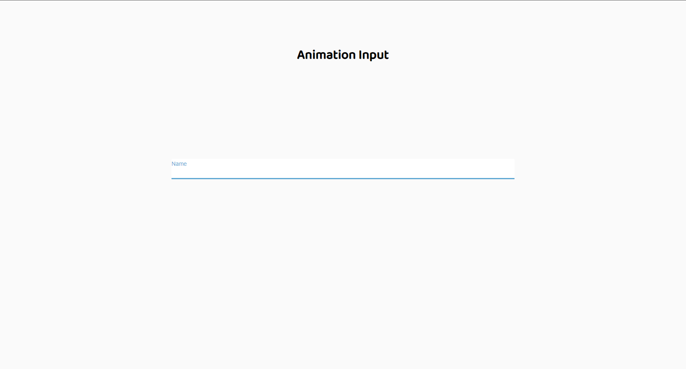

# Login_example

> Animating and customizing an input.

## Table of contents

- [General info](#general-info)
- [Screenshots](#screenshots)
- [Technologies](#technologies)
- [Contact](#contact)

## General info

Adding animations to an input type text only css.🎨

## Screenshots

## Technologies

- HTML5
- CSS3

## Contact

Created by [@jhosep98](https://jhosep98.github.io/Portfolio2020jdb/) - feel free to contact me!
